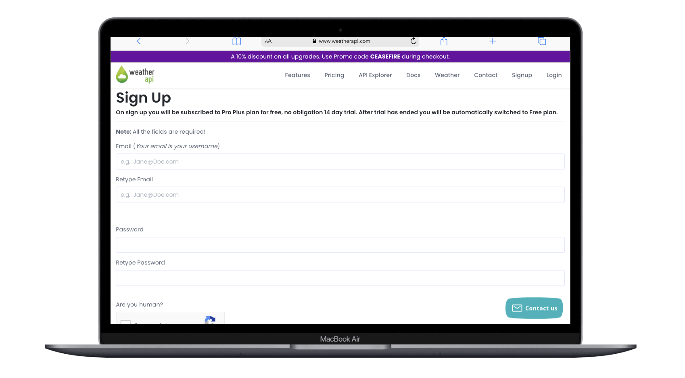

# Open weather API

"Ob havo dasturi" deganda, siz ob-havo ma'lumotlarini olish, namlik, harorat, shamol tezligi, va boshqa ma'lumotlarga haqida bilishingiz mumkin! OpenWeather API-dan foydalanganizda, siz umummiy ob-havo ma'lumotlarini olishingiz mumkin.

OpenWeather API, dunyodagi ob-havo ma'lumotlarini taqdim etuvchi umummiy (qo'llanma) interfeysini (API) ta'minlovchi tizimdir. Bu API orqali siz dasturingizga har bir geografik nuqtasi uchun ob-havo ma'lumotlarini olishingiz mumkin.

1. https://www.weatherapi.com/signup.aspx saytidan ro'yhatdan o'tamiz 

2. [Kerakli](https://www.weatherapi.com/my/) bo'limdan API key yaratib olaimz va davom etamiz !

- <code>key = 'SIZNING_API_KLUC'</code>
- <code>city = 'Toshkent'</code>
- <code> url = 'https://api.weatherapi.com/v1/current.json?key={key}&q={city}' </code>

4. Loyihaning dizayni:

- https://www.figma.com/file/oMogX6IpeCCwByWU7Bi7EI/Weateher-app?type=design&node-id=0%3A1&mode=design&t=4ZjlpkqjbidUOaYD-1

## Example request

baseURL: `/https://api.weatherapi.com/v1`
final: `/current.json?key={key}&q={city}`

[GET] `/` endpoint uchun

| Parameter | value      |
| --------- | ---------- |
| `q`       | "Toshkent" |
| `key`     | api_key    |

- [GET]: Bugungi ohirgi ma'lumot uchun : `https://api.weatherapi.com/v1/current.json?key={key}&q={city}`
- [GET]: Bir necha kunlik "prognoz" uchun : `https://api.weatherapi.com/v1/forecast.json?key={key}&days={day_number}&q={city}`

