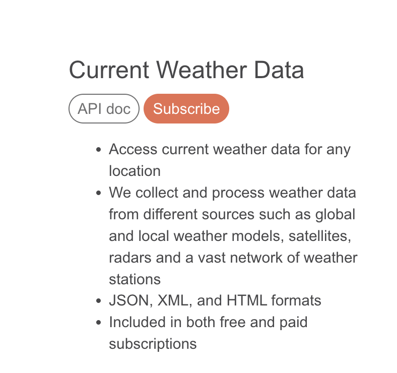
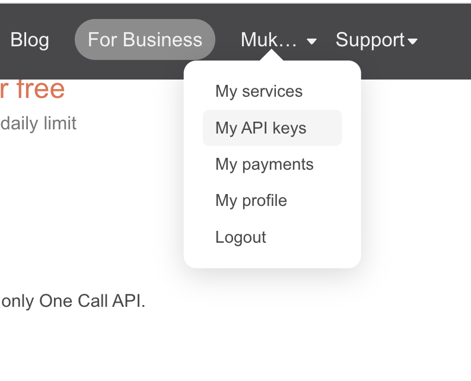

# Open weather API

"Ob havo dasturi" deganda, siz ob-havo ma'lumotlarini olish, namlik, harorat, shamol tezligi, va boshqa ma'lumotlarga haqida bilishingiz mumkin! OpenWeather API-dan foydalanganizda, siz umummiy ob-havo ma'lumotlarini olishingiz mumkin.

OpenWeather API, dunyodagi ob-havo ma'lumotlarini taqdim etuvchi umummiy (qo'llanma) interfeysini (API) ta'minlovchi tizimdir. Bu API orqali siz dasturingizga har bir geografik nuqtasi uchun ob-havo ma'lumotlarini olishingiz mumkin.

1. https://openweathermap.org saytidan ro'yhatdan o'tamiz 

2. Kerakli bo'limdan API key yaratib olaimz va davom etamiz !

3. 

 

- <code>api_key = 'SIZNING_API_KLUC'</code>
- <code>city = 'Toshkent'</code>
- <code> url = 'http://api.openweathermap.org/data/2.5/weather?q={city}&appid={api_key}' </code>

4. Loyihaning dizayni:

- https://www.figma.com/file/oMogX6IpeCCwByWU7Bi7EI/Weateher-app?type=design&node-id=0%3A1&mode=design&t=4ZjlpkqjbidUOaYD-1

## Example request

final: `/weather?q={city}&appid={api_key}`

[GET] `/weather` endpoint uchun

| Parameter | value      |
| --------- | ---------- |
| `q`       | "Toshkent" |
| `appid`   | api_key    |

